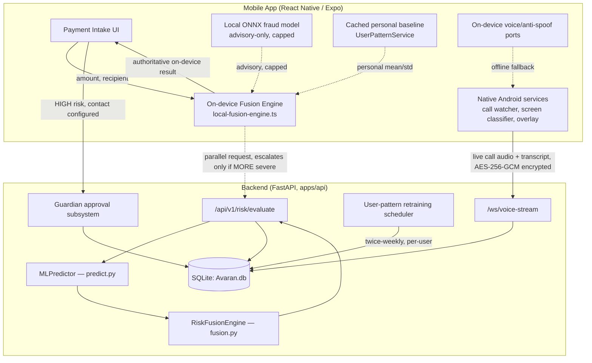

# AVARAN — Complete System Architecture

**Purpose of this document:** a single, current, end-to-end description of how AVARAN actually works today — mobile app, backend, ML pipeline, security, and deployment — written for study (e.g. via NotebookLM), not as a spec. It supersedes the repo-layout/database claims in `docs/ARCHITECTURE.md` and `docs/ML_ARCHITECTURE.md`, which predate the on-device ML system and contain stale claims (noted in §11). `docs/SECURITY.md` §12 remains the authoritative source on the on-device/encryption trust boundary; this document restates and extends it with the rest of the system.

**What AVARAN is:** a fraud-shield app that protects a user's UPI payments and phone calls. It scores every payment for fraud risk (a fused decision combining a trained fraud model, behavioural anomaly detection, device trust, and — during calls — voice risk), and it detects live social-engineering/vishing attempts during phone calls using on-device speech recognition plus a backend voice-risk classifier.

---

## 1. Repo Layout

```
D:\AVARAN\S40
├── apps/
│   ├── api/          FastAPI backend — the real source of truth for risk decisions
│   ├── mobile/        React Native / Expo app — the primary client
│   └── web/           Next.js app — institution dashboard / marketing surfaces
├── ml/                 Training, inference, feature engineering, model registry/export
├── voice/              Python source-of-truth voice/anti-spoofing logic (mobile TS ports this)
├── engine/              Support-AI "Columbo Protocol" trap-prompt logic (backend-only, never on-device)
├── docs/                Architecture / security / model-card / spec documents
├── scripts/            Data generation, DB seeding, ML pipeline runner, ad hoc integration scripts
├── Avaran.db            Root SQLite database file
├── railway.toml, nixpacks.toml, Procfile   Deployment config (Railway + Nixpacks)
├── requirements.txt      Pinned Python deps installed at deploy time
├── .env.example          Documented environment variable names (no real secrets)
└── server.js             Dev-only launcher that spawns uvicorn — NOT a production server
```

There is **no Dockerfile, docker-compose.yml, or CI config** anywhere in the repo — deployment is Railway/Nixpacks only (§10). `apps/web` and the root `main.py`/`session_manager.py` orchestration layer exist but are secondary to the mobile app + `apps/api` pairing that carries the actual product.

---

## 2. High-Level Data Flow



**The trust boundary, in one sentence:** the on-device fusion result is the *default, authoritative* result shown to the user and works fully offline; the server call still runs whenever reachable and *only escalates* the result when it finds something strictly more severe — it never downgrades or silently replaces an on-device result of equal or higher severity.

---

## 3. Backend (`apps/api`)

### 3.1 Entrypoint and middleware
`apps/api/app/main.py` builds the FastAPI app, then applies middleware outer→inner:
1. `GZipMiddleware` (responses ≥500 bytes)
2. Custom HTTPS/security-header middleware — enforces HTTPS (trusted-proxy aware), injects HSTS, `X-Content-Type-Options`, `X-Frame-Options`, `Referrer-Policy`, `X-XSS-Protection`
3. `CORSMiddleware` — explicit localhost/LAN allowlist + private-IP regex, credentials allowed

`/health` and `/health/db` back liveness/readiness checks; `/` redirects to `/docs` (OpenAPI/Swagger).

Two background workers start in `main.py`'s `lifespan()`:
- **Guardian expiry sweep** — periodically expires Guardian approval requests past their 120-second deadline, independent of any client polling.
- **User-pattern retraining sweep** (§5.4) — opportunistic backstop sweep, separate from the scheduler's own bounded-concurrency loop.

### 3.2 API routers (`apps/api/app/api/routers/`)

| Router | Responsibility |
|---|---|
| `auth.py` | Signup/login, OTP, password reset, rate limiting, anti-enumeration, single-device binding |
| `users.py` | User profile, `/overview` (home-screen summary), `/transactions` (list), `/device-check` (known-device lookup) |
| `transactions.py` | Core transaction lifecycle — create, confirm, cancel, report; the mobile-facing surface |
| `payments.py` | AVARAN-PAY-spec-shaped payment lifecycle (prepare/analyse/authorize), shares services with `transactions.py` |
| `risk.py` | `/api/v1/risk/evaluate` — the **authoritative, real-time** risk scoring endpoint |
| `guardian.py` | Guardian/Family Shield approval requests, responses, polling |
| `financial_profile.py` | Personalized transaction-pattern engine endpoints (baseline sync, model artifacts) |
| `statements.py` | Bank statement upload/OCR/parsing to bootstrap a new user's baseline |
| `voice_stream.py` | `/ws/voice-stream` — real-time WebSocket for live speech + audio anti-spoofing |
| `alerts.py` | Read-only alert feed (nothing auto-creates alerts outside HIGH/MEDIUM risk flows) |
| `notifications.py` | In-app notification feed |
| `institution.py` | Bank Analyst Review Console (fraud case review) |
| `demo.py` | Judge-facing demo transaction generator |
| `simulator.py` | One-click demo scenario presets |

### 3.3 Database
SQLAlchemy ORM over SQLite (`Avaran.db`, default `DATABASE_URL=sqlite:///./Avaran.db`). PostgreSQL is the documented eventual target but **not yet implemented** — the older `docs/ARCHITECTURE.md` claim of "PostgreSQL primary store" is stale. Alembic (`apps/api/alembic/`) owns migrations.

Key model groups:
- **Auth/identity**: `user.py`, `user_credentials.py` (isolated password hash/lockout), `user_session.py` (JWT + single-device binding), `user_contact_info.py` (encrypted contact details), `trusted_device_binding.py`, `auth_rate_limit.py`, `otp_verification.py`, `password_reset_authorization.py`
- **Payments/risk**: `transaction.py`, `statement_ledger_transaction.py` (statement-derived history, kept separate from live transactions), `recipient.py`, `device.py`, `risk_score.py`, `risk_factor.py`, `user_feedback.py`
- **Voice**: `voice_analysis.py` — transcript **hash** (not raw text) + urgency/threat/authority/financial-request/coercion scores
- **Personalization**: `user_financial_profile.py` (interpretable baseline stats), `user_model_artifact.py` (versioned per-user on-device artifacts)
- **Guardian**: `guardian_request.py`, `trusted_contact.py`
- **Institution**: `fraud_case.py`, `alert.py`
- **Audit**: `audit_log.py`

### 3.4 Auth flow
- `session_service.py` — opaque CSPRNG session tokens (`usr_sess_<48B urlsafe>`); only a SHA-256/peppered **hash** of the token and device ID is ever stored; absolute + inactivity expiry; single active trusted device per account.
- `otp_service.py` — CSPRNG 6-digit codes, salted HMAC-SHA256 hashed, constant-time verified. **Dev/sandbox bypass**: `otp_delivery_provider="mock"` + `enable_dev_otp_inspection=True` (both defaults, no `.env` override in this repo) surfaces the real code as `devTestCode` in the signup response for testing without SMS delivery.
- `rate_limit_service.py` — progressive lockouts, timing-safe anti-enumeration.
- `security_audit_service.py` — structured security event logging across auth, device binding, password recovery, Guardian review, and transaction integrity.

### 3.5 Payment workflow integrity
- `payment_workflow_guard.py` — server-side enforcement of valid payment-stage transitions; rejects a client trying to skip or forge a stage.
- `transaction_state_machine.py` — the single canonical authority for what status transitions are legal.
- `transaction_integrity_service.py` — cryptographically binds a Guardian/biometric authorization to an immutable snapshot of the transaction's parameters (amount, recipient, risk score) so it can't be silently altered between approval and execution.

---

## 4. ML Pipeline (`ml/`)

### 4.1 Training (`ml/training/`)
Separate synthetic-only and real-data trainers per model family:
- `train_fraud.py` / `train_fraud_real.py` (fraud)
- `train_anomaly.py` / `train_anomaly_real.py` (behavioural anomaly)
- `train_voice.py` (voice scam-intent NLP)
- `train_user_pattern.py` — per-user micro-model: fits an `IsolationForest` if a user has ≥30 confirmed transactions, otherwise ships an interpretable quantile-JSON baseline (p50/p90/p99/shrunkMean/shrunkStd)

Supporting infra: hyperparameter search, isotonic calibration, evaluation, dataset assembly, feature manifests.

### 4.2 Inference (`ml/inference/`) — what actually runs live
- **`predict.py`** — the "Unified ML Prediction Engine": loads every serialized artifact once (fraud XGBoost, scaler, anomaly IsolationForest, voice NLP, fusion config), exposes a single `predict(payload) -> dict`: feature extraction → multi-model scoring → rule evaluation → SHAP explainability → fusion. **This is what `/api/v1/risk/evaluate` actually calls** — target latency <50ms.
- **`fusion.py`** (`RiskFusionEngine`) — combines sub-scores via **probabilistic saturation**, not a naive weighted sum, specifically to avoid double-counting correlated signals:

  ```
  Risk_fused = 100 × (1 − Π(1 − w_i · s_i))
  ```

  Weights: `transaction_fraud=0.35, behaviour_anomaly=0.25, device_risk=0.20, voice_risk=0.20`. A rule engine adds independent penalty rules on top (new-device-high-value, high-amount-spike, velocity-burst, rapid-successive-transfer), then a **single-signal override** floors the score to 0.78 (HIGH) if any one signal is severe enough on its own (`p_fraud≥0.75` after rescale, or `amount_vs_avg_ratio≥15`/`s_anomaly≥0.85` when the payment doesn't match a recognized recurring pattern). Tiers: LOW ≤30 (Allow), MEDIUM ≤60 (Warn + Choice), HIGH >60 (Confirm-or-Cancel / Guardian gate).
- Note: the codebase also contains a more elaborate `anomaly.py` (`BehaviourAnomalyDetector`) that is **not** in the live path — `predict.py` uses the plain `IsolationForest` artifact directly.

### 4.3 Feature engineering (`ml/features/`)
`transaction_features.py`, `behaviour_features.py`, `device_features.py`, `voice_features.py`, `recipient_features.py`, `recipient_pattern_features.py` (the recurring-payment/cadence features — see §6.3). The real-data models are **recipient-centric**, not per-sender — a pivot made because none of the available real fraud datasets have repeat senders.

### 4.4 Model export and registry
- `ml/export/to_onnx.py` exports the fraud XGBoost booster (not the isotonic calibrator — no standard ONNX isotonic op) for on-device mobile inference. **This means the mobile ONNX signal is the raw, uncalibrated model output**, not directly comparable numerically to the backend's calibrated score (see §6.1 for why this mattered and was a real bug).
- `ml/registry/model_registry.py` — one JSON pointer file per detector (`ml/models/<detector>/registry.json` → `{"current", "previous", "experimental"}`), artifacts git-ignored.

### 4.5 Model cards — what's actually trained

**`s40_transaction_fraud_real`** (current, `docs/FRAUD_MODEL_CARD_REAL.md`):
- XGBoost, `max_depth=4, n_estimators=60, learning_rate=0.1` — deliberately small (112KB) for on-device export.
- Data: Indian Online Scam dataset (real, primary) + PaySim (real, capped) + S40 synthetic minority (15%), 177,753 rows, chronological per-source split.
- Isotonic calibration: test PR-AUC 0.8020, ROC-AUC 0.9558, **ECE 0.00442 (calibrated) vs 0.1244 (raw)**.
- Selection rule favors generalization (test PR-AUC band [0.80, 0.87], smallest train/test gap) over the single highest score.

**`s40_behaviour_anomaly_real`** (current, `docs/ANOMALY_MODEL_CARD_REAL.md`):
- Isolation Forest, unsupervised, trained on non-fraud rows only.
- Features intentionally reduced from 6 to 3 (`amount_log`, `recipient_amount_zscore`, `recipient_amount_vs_average`) after discovering the original 6-feature set silently nulled out PaySim entirely (no wall-clock timestamp in that dataset).
- Honest post-fix metric: **test ROC-AUC 0.736**, PR-AUC 0.231 — openly documented as still majority-synthetic (83.9% of scorable test rows) and near-chance on the Indian-only slice alone.

---

## 5. Personalization: "Nothing Generic, Everything Adaptive"

This was a hard product requirement: every risk calculation must be specific to the individual user's own transaction history or uploaded statement, on both server and device — a student and a salaried parent must score differently for the same amount.

### 5.1 Statement-trained baseline
A user can upload a bank statement (OCR + best-effort Indian statement table parsing, `statement_extraction_service.py`/`statement_parser_service.py`) before or after signup. The backend's `user_pattern_trainer.py` computes per-user percentiles (p50/p90/p99, shrunk mean/std) and, once ≥30 confirmed transactions exist, fits a real per-user `IsolationForest`.

### 5.2 Sync to device
`UserPatternService` (mobile) syncs this baseline via `/model-sync`, caches it in `SecureStore`, and exposes it to the on-device fusion engine via `getCachedBaseline(userId)`. This closed a real gap found mid-session: a first-ever payment to a brand-new recipient previously had *nothing* personalized to compare against (a neutral ratio=1/zscore=0 default) — now it falls back to this real statement-trained baseline instead.

### 5.3 Scalable retraining scheduler
`apps/api/app/services/user_pattern_scheduler.py` retrains each user's pattern model **twice a week**, designed to not overload the server as the user base grows toward millions:
- Bounded concurrency via `asyncio.gather` under a `TRAINING_SEMAPHORE`.
- **Race-safe atomic claiming**: `claim_profile_for_retrain(db, user_id)` is a single `UPDATE ... WHERE needs_retrain = True` — two concurrent sweep workers can never both claim and retrain the same profile.
- Adaptive busy/idle pacing (config: `user_pattern_retrain_cooldown_hours=84`, `user_pattern_sweep_batch_size=50`, `user_pattern_sweep_busy_pause_seconds=5`).
- Verified with 7 dedicated tests (including an explicit "second claim on the same profile fails" race test) plus the full 284-test backend suite.

### 5.4 Recurring-payment recognition (avoiding permanent false alarms)
A legitimate recurring payment (e.g. monthly rent far above a student's daily-spend baseline) must stop being flagged once it's established, without weakening genuine anomaly detection. `ml/profiles/recurring_pattern.py` (server) and `local-recurring-pattern.ts` (device, exact port) implement two independent paths to "trust":
- **Cadence-based**: 3+ occurrences at a consistent weekly/biweekly/monthly interval (±10% amount tolerance).
- **Confirmation-fast-path**: 2+ explicit user confirmations of payments to the same recipient, even without a detected cadence yet.

A match dampens the anomaly sub-score (×0.15) and — critically — is excluded from the single-signal override's amount/anomaly legs (so a genuine coercion/voice-threat signal still floors to HIGH regardless of recurring status; only the amount/anomaly legs are gated).

---

## 6. On-Device ML (The Trust-Boundary System)

This is the newest and most architecturally significant layer, built to satisfy: *"payment risk scoring should run locally on device"* while *"keeping the connection — evaluation score should be calculated on device rather than server."*

### 6.1 What runs on-device
`apps/mobile/src/services/ml/`:
- **`local-fusion-engine.ts`** — an exact numeric port of `fusion.py` (same weights, same probabilistic-saturation formula, same rule table, same override thresholds, same tier boundaries).
- **`local-device-risk.ts`** — on-device "is this a known device" signal, synced via the backend's `/device-check` endpoint and cached.
- **`local-recurring-pattern.ts`** — the on-device mirror of §5.4.
- **`recipient-risk-service.ts`** — a **secondary, advisory-only** local ONNX model (`fraud_real.onnx`, the raw uncalibrated export from §4.4). Its own docstring is explicit: *"NOT AN AUTHORITATIVE RISK SIGNAL... must never gate, block, or silently substitute for the real risk call."*

A real bug was found and fixed here: `payment-service.ts` was feeding that raw, uncalibrated ONNX score directly into the fusion math's single-signal override, letting model noise alone float an innocuous small payment (₹50) to HIGH — completely bypassing the user's actual personalized history. Fixed by capping the signal to only nudge the weighted score (never solely trigger the override), consistent with its own documented contract.

### 6.2 Trust boundary / priority (payment-service.ts's `evaluatePayment()`)
```
1. Compute the on-device result (evaluatePaymentLocal) — this is the DEFAULT,
   authoritative result. Fully usable offline.
2. In parallel, call the real server endpoint whenever reachable.
3. If the server result is STRICTLY MORE severe than the on-device result,
   use the server result (a genuine escalation using data the phone
   couldn't see, e.g. cross-device history).
4. Otherwise (server unreachable, equal severity, or server result is LESS
   severe) — the on-device result stands. The server never silently
   downgrades or replaces an on-device result of equal or higher severity.
```
This was flipped mid-session from the opposite (backwards) default — the original logic defaulted to showing the server's result on ties, which visually looked like "nothing is computed on-device" even when it was.

### 6.3 Voice / anti-spoofing on-device ports
Ported from the Python `voice/` package for offline fallback when `/ws/voice-stream` is unreachable: TF-IDF/LogisticRegression scam-intent classifier with a multilingual Aho-Corasick trie and a leaky-bucket risk accumulator (`nlp/voice-classifier.ts`), plus an on-device audio anti-spoofing math port (`audio-anti-spoofing.ts`). ONNX export was explicitly rejected for the NLP classifier due to a risky contrib-op tokenizer dependency.

---

## 7. Guardian / Family Shield Approval Flow

For HIGH-risk payments, if the user has a trusted contact configured and the feature is enabled, the payment can be routed to that contact for a **2-minute** approval window (matches the backend's real enforced expiry — a stale hardcoded 60s value in the UI was fixed to match).

- `GuardianContext.tsx` (mobile) owns `activeRequest`, `pendingRequests`, live polling, and countdown/expiry timers; `initiateGuardianRequest()` is a no-op whenever `isTrustedFeatureEnabled` is false or no contact exists.
- **User control**: a `Trusted Contact Review` toggle now lives in the Profile screen (previously only reachable inside Trusted Contacts, and only once a contact existed). When disabled, the high-risk intake screen's action button reads **"CONTINUE (ACCEPTING RISK)"** instead of "PROCEED TO GUARDIAN REVIEW" — the UI never implies a Guardian review is about to happen when it structurally can't. The already-persisted-transaction confirm flow correctly falls through to a biometric-authorization gate in this case, rather than silently auto-approving.
- Backend: `guardian_request.py`/`trusted_contact.py` models, `guardian.py` router, a background expiry-sweep worker that proactively expires stale requests server-side (not dependent on the client polling).

---

## 8. Voice / Call Protection Pipeline

The **currently active** real path (per `LiveCallAudioService.kt`'s own docstring — a legacy Bhashini-backed raw-PCM path also exists but is disabled, since Bhashini credentials aren't configured):

1. `OnDeviceSpeechRecognizer` wraps Android's built-in (free, no API key) `SpeechRecognizer` for continuous live transcription during a call.
2. Each utterance streams as text to `/ws/voice-stream` via `VoiceClassifierClient`.
3. **Concurrently**, a second `AudioRecord` session streams raw PCM audio chunks over the same socket — **AES-256-GCM encrypted on-device** (`AudioStreamCrypto.kt`) and **decrypted only server-side** (`app/core/audio_stream_crypto.py`, shared key `VOICE_STREAM_AUDIO_KEY_B64`) — feeding the backend's audio anti-spoofing / fused-score / Adaptive-Copilot pipeline with **real call audio** for the first time; this used to only be reachable from the in-app simulator.
4. A HIGH/CRITICAL result (or synthetic-voice detection) triggers `FraudOverlayManager`, a full-screen native warning overlay, with the complete enriched response (previously most of this response was silently dropped before reaching the user — this was audited and fixed this session).
5. `PaymentScreenWatcherService.kt` (an `AccessibilityService`) separately watches UPI app screens via `UpiScreenClassifier.kt` — a purely structural classifier (screen states only: NONE / PRE_PIN_PAYMENT / PIN_ENTRY) that explicitly never captures amounts, recipient names, or VPAs, to detect an in-progress payment during a live scam call.

Mobile-side mirror: `voice-service.ts` normalizes WebSocket responses, with an on-device fallback (§6.3) if the socket is unreachable.

**Encryption threat model** (per `docs/SECURITY.md` §12): protects against network eavesdroppers, not the server operator — the server still decrypts and can see plaintext audio server-side. Federated learning / client-held keys was explicitly considered and rejected as out of scope.

---

## 9. Mobile App Structure (`apps/mobile`)

### 9.1 Navigation
`RootNavigator.tsx` — gated on `useAuth().isAuthenticated`:
- **Unauthenticated stack**: Landing → Signup → OTP verification → Login → Forgot/Reset Password.
- **Authenticated stack**: `Tabs` (bottom-tab navigator) + modal screens (Connected Apps, Alert Detail, History Detail, Voice).

`TabNavigator.tsx` — 5 tabs: **Home, AVARAN PAY (Payments), Protection, Trusted, Profile**, each wrapped in an animated `TabTransitionWrapper`; wraps its screens in `GuardianProvider` + `AlertBadgeProvider`.

### 9.2 Context providers (`src/context/`)
| Provider | Owns |
|---|---|
| `AuthContext` | Login/signup/session state |
| `GuardianContext` | Guardian approval flow, trusted contacts, the feature toggle (§7) |
| `BiometricContext` | Biometric auth status + inactivity-based re-auth |
| `SecurityContext` | Live call snapshot, security alerts, transaction history |
| `AlertBadgeContext` | Protection-tab and notification-bell badge counts |
| `AppHealthContext` | App health metrics, freeze-incident detection |

### 9.3 Native Android layer (`android/app/src/main/java/com/avaran/security/`)
- `services/PaymentScreenWatcherService.kt`, `UpiScreenClassifier.kt` — UPI screen detection (§8.5)
- `telemetry/LiveCallAudioService.kt`, `OnDeviceSpeechRecognizer.kt`, `VoiceClassifierClient.kt`, `AudioStreamCrypto.kt`, `CallGuardModule.kt`/`CallGuardPackage.kt` — the call-protection pipeline (§8)
- `ui/FraudOverlayManager.kt` — the full-screen fraud warning overlay
- `net/RiskApiClient.kt` — native OkHttp client for the risk API
- `config/DevConfig.kt` — dev/build configuration

---

## 10. Deployment

- **Mechanism**: Railway + Nixpacks (no Docker, no CI anywhere in the repo).
  - `railway.toml`: Nixpacks builder, start command `python3 -m uvicorn main:app --host 0.0.0.0 --port ${PORT:-8000}`, restart-on-failure (max 3 retries).
  - `nixpacks.toml`: Python 3.11 + pip.
  - `Procfile`: Heroku-style fallback, same uvicorn command.
  - Production reference URL (per `docs/SECURITY.md`): `https://s44-production.up.railway.app`.
- **Python dependencies**: root `requirements.txt`, pinned — FastAPI 0.141.1, SQLAlchemy 2.0.52, Alembic 1.19.1, XGBoost 3.2.0, scikit-learn 1.9.0, onnx/onnxruntime/onnxmltools/skl2onnx, shap 0.51.0, cryptography 50.0.1, pytest 9.1.1.
- **Environment variables** (`.env.example`): `APP_NAME`, `ENVIRONMENT`, `DATABASE_URL`, `HASH_PEPPER` (must be overridden in production — enforced by `config.py`), `CONTACT_INFO_ENCRYPTION_KEY` and `APP_DATA_ENCRYPTION_KEY` (Fernet keys, production-uniqueness enforced). Commented placeholders exist for a future Postgres/Redis migration and ML/voice config, not yet wired up.
- **Mobile**: standard Expo/EAS build config (`app.json`, `eas.json`); no custom CI wiring.
- **Web**: standard Next.js app, no custom deploy config found.

---

## 11. Encryption & Data-Handling Summary (from `docs/SECURITY.md`)

- **Hashing, not encryption, for identifiers**: device IDs, phone numbers, and recipient handles are salted-hashed at ingestion (`hash_identifier`) — never stored or transmitted in a reversible form.
- **Encryption at rest**: `app/core/field_encryption.py`'s `EncryptedText` (Fernet) transparently encrypts free-text PII-adjacent columns — `Notification.title/body`, `Alert.summary`, `Transaction.location`, `GuardianRequest.resolution_notes`, `FraudCase.review_notes`. Deliberately *not* encrypted: one-way hashes and plaintext numeric amounts (needed for server-side aggregation/training).
- **Voice/audio policy**: `audio → transcription/features → risk analysis → discard raw audio`; raw audio is not retained outside the live pipeline/demo recordings.
- **Auth**: JWT/session tokens stored only as hashes; RBAC roles `USER` / `INSTITUTION_ANALYST` / `ADMIN`.
- **Support-AI boundary**: a conversational LLM (the "Columbo Protocol" trap-prompt engine in `engine/copilot/`) must never become the fraud-decision authority — it has no write path into risk decisions, and its trap-prompt logic is intentionally **not** ported to the mobile client.
- **No proprietary AI dependency** for core functionality (STT, support LLM, TTS, voice analysis) — a deliberate data-governance decision to avoid routing user audio/text through third-party inference APIs by default.

---

## 12. Known Documentation Gaps (as of this document)

- `docs/ARCHITECTURE.md` and `docs/ML_ARCHITECTURE.md` predate the on-device ML system entirely — their repo-layout diagrams omit `apps/mobile/` and reference a `docker-compose.yml`/`infra/` that don't exist, and their database section still claims PostgreSQL as the primary store when the running system uses SQLite. Treat them as historical/planning artifacts, not current fact, until they're revised.
- `docs/SECURITY.md` §12 previously flagged "no real microphone/live-call-audio capture pipeline" as an unscoped gap — this is now stale; `LiveCallAudioService.kt` implements exactly that pipeline (§8).
- This document (`SYSTEM_ARCHITECTURE_COMPLETE.md`) is the most current cross-cutting description as of the date it was written; re-verify against the code before relying on specific numbers (test counts, model metrics) if significant time has passed.
